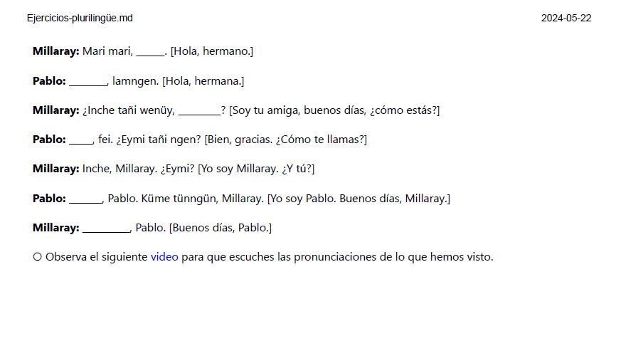
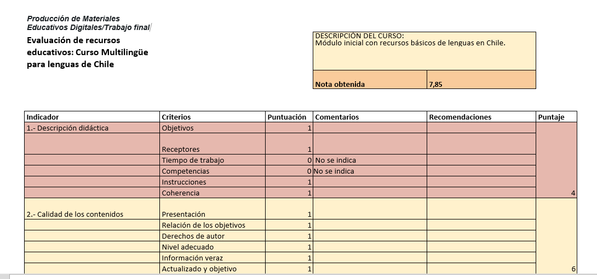

# Chile Multilingüe

---

### ÍNDICE
1. Objetivo
2. Estructura
3. EPUB
4. PDF
5. Twine
6. Autoevaluación
7. Conclusiones

---

## 1. Objetivo 🥇 

**Acercar a los hablantes a algunas variedades lingüísticas que cohabitan en Chile.**

Desde el español como lengua vehicular, se espera que los estudiantes reconozcan términos básicos de: el Mapudungún, lengua del pueblo Mapuche; el Aimara, lengua de un pueblo originario del altiplano andino; y Kreyòl o haitiano criollo, lengua de los inmigrantes haitianos.

---

## 2. Estructura  

 
 

### Este curso cuenta con:
+ Un ***epub*** con información básica respecto de los saludos, despedidas y frases de cortesía.
+ Un ***PDF*** con ejercicios para practicar.
+ Una historia de ***Twine*** para ejemplificar el uso de las lenguas en un contexto narrativo.
+ Esta presentación en ***reveal.js***.

---

## 3. EPUB

---

### Dentro del EPUB podrás encontrar el contenido que necesitas para realizar el curso.

 

---

## 4. PDF

---

### Dentro del PDF podrás encontrar ejericios que te servirán para practicar lo aprendido.

---

## 5. Twine

 
 

---

### Dentro del Twine podrás encontrar un ejemplo de las lenguas en uso.

---

## 6. Autoevaluación

---

### En este apartado se realizó una autoevaluación respecto del curso realizado,  siguiendo la norma UNE 71362.

#### El puntaje obtenido fue de 7.8, lo cual indica que aún se debe trabajar en el desarrollo de los cursos virtuales para crear un material de calidad.

---

## 7. Conclusiones

---

Esta presentación abordó el trabajo que se realizó para la evaluación final de la asignatura de Producción de Materiales Educativos Digitales.
Se abordó de modo somero el contenido, pues la finalidad es mostrar el uso de las variados formatos que se abordaron en este curso, tales como la generación de PDF e EPUB a partir de MARKDOWN.
Del mismo modo, se pudo apreciar la creación de recursos didácticos como TWINE.
Por último queda seguir trabajando para adquirir mayores competencias digitales y así desarrollar material que cumpla con todos los puntos que propone la norma UNE 71362.

--- 

## Gracias